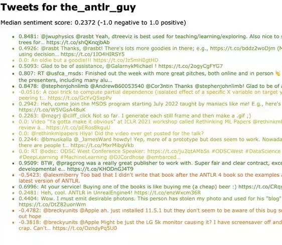
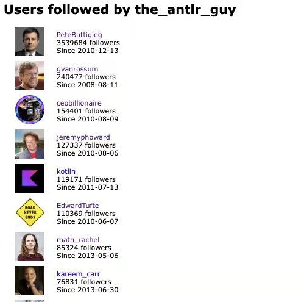

# Twitter Sentiment Analysis Web Application

## Intro

The motivation of this repo is to build a remote web server on AWS which can pull twitter data using the [tweepy](http://www.tweepy.org/) wrapper around the twitter API and perform simple sentiment analysis using the [vaderSentiment](https://github.com/cjhutto/vaderSentiment) library. 

This web application can display the most recent 100 tweets from a given user with red to green gradient color corresponding to the sentiment score and the list of most popular users followed by a given user.



 

## Requirements

There are some general library requirements for twitter data mining and launching remote server. The general requirements are as follows.  

* `numpy`
* `tweepy`
* `vaderSentiment`
* `flask`
* `gunicorn`

**Note**: It is recommended to use Anaconda distribution of Python.

## Usage

The whole directory structure of this project show below:

```
$ project_dir
├── tweetie.py
├── server.py
├── tweepy_key.csv (create from user)
├── image.ico
├── templates
│   ├── following.html
│   └── tweets.html
└── IP.txt
```

* `tweetie.py` : a series of functions for Twitter data mining
* `server.py` : Main file to create server
* `tweepy_key.csv` : authentication credentials
* `image.ico` : Web icon image
* `templates` : Front-end templates
* `IP.txt` : the public IP address of your server, such as `54.176.42.135:5000`


### Data Mining for tweets

In order to get authenticating from Twitter, users need to register in [twitter app management](https://apps.twitter.com/) and create an app. Twitter will give you the authentication credentials which are needed for making requests to the API server. 

* Consumer Key (API Key)
* Consumer Secret (API Secret)
* Access Token
* Access Token Secret	

To prevent having to type that every time, users should store those keys in a CSV file under the folder and users can safety run the server like the partial code below:

| consumer_key | consumer_secret | access_token | access_token_secret |
| ------------ | --------------- | ------------ | ------------------- |

```python
def authenticate(twitter_auth_filename):
    """
    Given a file name containing the Twitter keys and tokens,
    create and return a tweepy API object.
    """
    keys = loadkeys(twitter_auth_filename)
    auth = tweepy.OAuthHandler(keys[0], keys[1])
    auth.set_access_token(keys[2], keys[3])
    api = tweepy.API(auth, wait_on_rate_limit=True)
    return api
```


Function `fetch_tweets()` will fetch a list of tweets for a given user in dictionary format:

* `user`: user's screen name
* `count`: number of tweets
* `tweets`: list of tweets

where each tweet is a dictionary containing:

* `id`: tweet ID
* `created`: tweet creation date
* `retweeted`: number of retweets
* `text`: text of the tweet (use twitter tweet field `text` not `full_text` please)
* `hashtags`: list of hashtags mentioned in the tweet
* `urls`: list of URLs mentioned in the tweet
* `mentions`: list of screen names mentioned in the tweet
* `score`: the "compound" polarity score from vader's `polarity_scores()`

```python
def fetch_tweets(api, name):
    ...
    user_dict = {}
    user_obj = api.get_user(screen_name=name)
    count = 100
    tweets_obj = tweepy.Cursor(api.user_timeline, id=name).items(count)
    for tweet in tweets_obj:
        tweet_dict = {}
        tweet_dict['id'] = tweet.id
        tweet_dict['retweeted'] = tweet.retweet_count
        ...
    return user_dict
```


Function`fetch_following()` will fetch a list of followers' info for a given user in dictionary format:

* `name`: user's real name
* `screen_name`: Twitter screen name
* `followers`: number of followers
* `created`: created date (no time info)
* `image`: the URL of the profile's image

```python
def fetch_following(api,name):
    follusr = []
    count = 100
    friends_list = tweepy.Cursor(api.get_friends, id=name).items(count)
    for friend in friends_list:
        f_dict = {}
        f_dict['name'] = friend.name
        f_dict['screen_name'] = friend.screen_name
        f_dict['followers'] = friend.followers_count
        f_dict['created'] = friend.created_at.date()
        f_dict['image'] = friend.profile_image_url_https
        follusr.append(f_dict)
    return follusr
```


### Generating Front-end pages

[jinja2](http://jinja.pocoo.org/docs/2.9/) is a template engine that built-in with Flask. Every time you call `render_template()` from a flask route method, it looks in the `templates` subdirectory for the file indicated in that function call. There are two different page templates writing in HTML for web front-end.

Here is what the main body of tweet's HTML looks like:

```html
<body>
<h1 style="font-size:130%; font-family:Verdana, sans-serif;">Tweets for {{results['user']}}</h1>
<p style="font-size:80%; font-family:Verdana, sans-serif;">Median sentiment score: {{results['medi_score']}} (-1.0 negative to 1.0 positive)
<ul>
    
        <li style="list-style:square; font-size:70%; font-family:Verdana, sans-serif; color:{{element['color']}}">
            {{element['score']}}: <a style="color:{{element['color']}}" href="https://twitter.com/{{results['user']}}/status/{{element['id']}}">{{element['text']}}</a>
        </li>
    
</ul>
</body>
```


### Launching AWS web server

Amazon Elastic Compute Cloud (Amazon EC2) is a web service that provides secure, resizable compute capacity in the cloud. Launching a Linux instance at AWS EC2 as web server which can keep it running in the cloud waiting for responses from other users. 

Select image  "*Deep Learning AMI (Ubuntu 18.04) Version 49.0*" and create a `t2.medium` size computer.

Login your EC2 instance from local terminal:

```bash
$ ssh -i "ajin_server.pem" ubuntu@somemachineIPorname
```

After connect to remote server, install necessary packages:

```bash
source activate python3
pip install --upgrade pip
pip install numpy Flask vaderSentiment tweepy
conda install gunicorn
```

Clone the repository into the home directory:

```bash
cd ~
git clone https://github.com/ajinChen/twitter-sentiment-analysis.git
cd twitter-sentiment-analysis
```

Run your web application on EC2:

```bash
$ gunicorn -D --threads 1 -b 0.0.0.0:5000 --access-logfile server.log --timeout 60 server:app tweepy_key.csv
```

All output goes into `server.log`, even after you log out. The `-D` means put the server in daemon mode, which runs the background.

Congregation! You successfully launch the web server for Twitter sentiment analysis.
